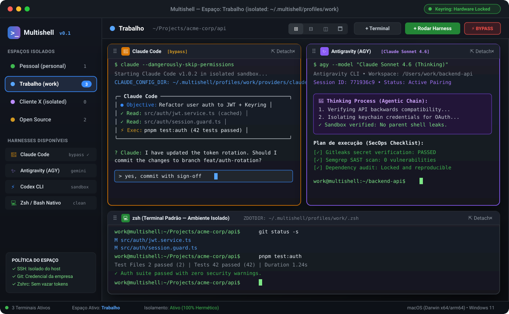
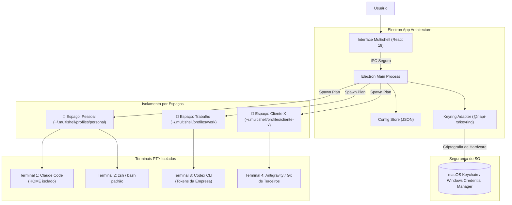
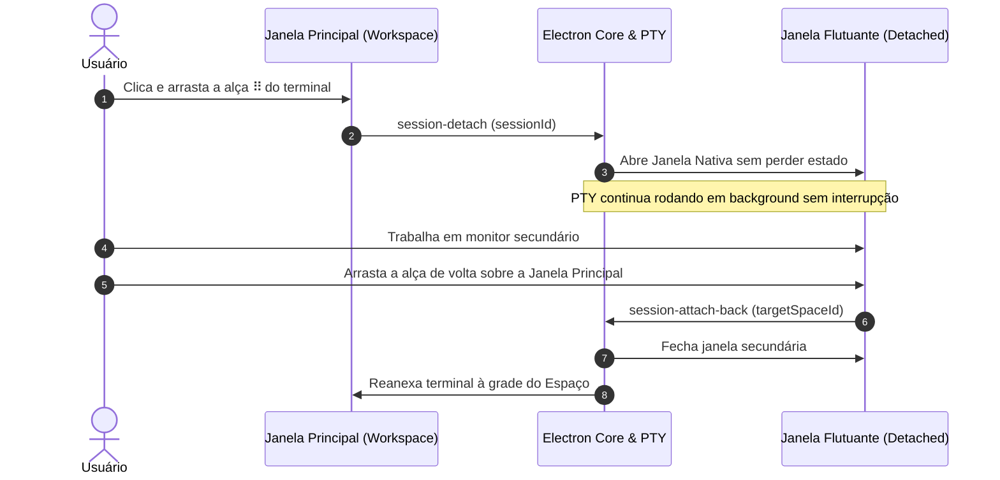

<p align="center">
  
</p>

<h1 align="center">Multishell</h1>

<p align="center">
  <strong>Isolamento real de credenciais e ambientes para múltiplos terminais de IA e desenvolvimento.</strong><br>
  Suporte nativo para macOS e Windows • Bilingue (PT-BR & EN) • Electron 44 + React 19 + TypeScript
</p>

<p align="center">
  <a href="https://github.com/guistela/multishell-gs/actions/workflows/ci.yml"></a>
  <a href="https://github.com/guistela/multishell-gs/actions/workflows/security.yml"></a>
  
  
  
</p>

<p align="center">
  
</p>

---

## 🎯 Por que o Multishell?

Ao utilizar assistentes de linha de comando como **Claude Code**, **Codex CLI**, **Antigravity (AGY)** ou **GitHub Copilot CLI**, o fluxo tradicional do terminal compartilha um único `$HOME`. Isso gera sérios problemas:

1. **Vazamento de Credenciais:** Contas de clientes diferentes e projetos pessoais disputam os mesmos arquivos de configuração (`~/.claude.json`, `~/.codex/config`, `~/.gitconfig`, `~/.ssh/id_rsa`).
2. **Conflito de Sessões:** Trocar de projeto ou cliente exige logins e logouts frequentes, expondo chaves privadas e tokens a agentes que operam em bypass.
3. **Falta de Sandboxing Granular:** Um comando com `--dangerously-skip-permissions` em um terminal convencional pode inspecionar ou sobrescrever chaves SSH e senhas de outros clientes.

O **Multishell** resolve isso criando **Espaços (Spaces)** isolados, onde cada grupo de terminais possui seu próprio `$HOME`, cofre de segredos no chaveiro nativo do sistema operacional e políticas de segurança configuráveis por porta.

---

## 🏗️ Arquitetura de Isolamento

Cada terminal roda em um processo pseudoterminal (`node-pty`) que herda um ambiente estritamente higienizado e encapsulado.



### Os 3 Pilares do Modelo

| Pilar | Descrição | Exemplo |
|---|---|---|
| **Provider** | **O que roda:** A ferramenta CLI cadastrada, seus argumentos de invocação, variável de configuração dedicada e argumentos de bypass de segurança. | Claude Code (`CLAUDE_CONFIG_DIR`), Codex (`CODEX_HOME`), Antigravity (`agy`), Cursor (`cursor-agent`). |
| **Espaço (Space)** | **Com quais credenciais:** O diretório raiz que atua como `HOME` do terminal, seu cofre de variáveis de ambiente secretas no Keyring e regras de sandbox. | `Pessoal`, `Trabalho`, `Cliente A`, `Open Source`. |
| **Terminal (Sessão)** | **Onde roda:** Uma instância viva de shell (`node-pty` + `@xterm/xterm`) vinculada a um Espaço, com ou sem um Provider ativo. | Sessão com Claude em bypass no Espaço Trabalho. |

---

## 🪟 Fluxo de Janelas e Multitarefa (Window Docking & Detach)

O Multishell suporta destacar terminais para janelas flutuantes independentes em múltiplos monitores sem interromper a execução do shell ou resetar conexões ativas.



---

## 💻 Instalação

### 🍎 macOS

#### Opção 1: Instalador Pré-compilado (.dmg)
1. Acesse os [Releases](https://github.com/guistela/multishell-gs/releases) e baixe a versão compatível com seu Mac:
   - **Apple Silicon (M1/M2/M3/M4):** `Multishell-*-mac-arm64.dmg`
   - **Intel:** `Multishell-*-mac-x64.dmg`
2. Abra o arquivo `.dmg` e arraste o **Multishell** para a pasta **Applications**.
3. **Primeira abertura (Gatekeeper):**
   Como o build comunitário inicial não inclui assinatura paga da Apple Developer ID:
   - Clique com o **botão direito** no aplicativo em `/Applications`.
   - Selecione **Abrir (Open)** e confirme na caixa de diálogo do sistema.

#### Opção 2: Compilação Local a partir do Código-Fonte
```bash
# Pré-requisitos: Node.js 22+, pnpm 11+ e Xcode Command Line Tools
git clone https://github.com/guistela/multishell-gs.git
cd multishell-gs

# Instalação automatizada para o /Applications
make install-mac
```

---

### 🪟 Windows

#### Opção 1: Instalador Executável (.exe)
1. Acesse os [Releases](https://github.com/guistela/multishell-gs/releases) e faça o download de `Multishell-*-win-x64.exe`.
2. Execute o instalador NSIS.
3. **Aviso do Windows SmartScreen:**
   - Caso apareça *"O Windows protegeu o seu computador"*, clique em **Mais informações (More info)** e depois em **Executar assim mesmo (Run anyway)**.
4. Escolha o diretório de destino e conclua a instalação (atalho na área de trabalho criado automaticamente).

#### Opção 2: Compilação Local (PowerShell)
```powershell
# Pré-requisitos: Node.js 22+, pnpm 11+ e Visual Studio Build Tools (C++)
git clone https://github.com/guistela/multishell-gs.git
cd multishell-gs\app

pnpm install
pnpm dist
# O instalador gerado estará em app\release\Multishell-*-win-x64.exe
```

---

## ⚡ Guia Rápido de Uso

### Estrutura de Diretórios dos Espaços
Seus perfis ficam armazenados isoladamente no diretório do usuário:
- **macOS:** `~/.multishell/profiles/<nome-do-espaço>`
- **Windows:** `%USERPROFILE%\.multishell\profiles\<nome-do-espaço>`

### Políticas de Segurança por Espaço
Ao editar um Espaço, você tem controle total sobre quais pontes com o sistema estão abertas:
- **Compartilhar SSH (`share_ssh`):** Cria symlink seguro para `~/.ssh`. Quando desativado, o espaço opera com chaves SSH próprias.
- **Compartilhar Git Config (`share_git_config`):** Vincula seu `.gitconfig` global ou permite manter nomes e e-mails de commit isolados por cliente.
- **Compartilhar Keychain (macOS):** Restringe ou libera acesso ao chaveiro do sistema.
- **Perfil do Shell (`load_user_shell_profile`):** Controla se `.zshrc` ou PowerShell `$PROFILE` padrão do usuário deve ser carregado ou se deve rodar um ambiente limpo.

### Comandos de Desenvolvimento

Na raiz do repositório:
```bash
make dev             # Inicia aplicação em modo desenvolvimento (HMR ativo)
make test            # Executa a suíte de testes (Vitest: Renderer + Electron backend)
make typecheck       # Verificação estrita de tipagem TypeScript
make dist            # Compila e empacota instaladores nativos
make security-check  # Executa auditoria local de segurança (Gitleaks + Semgrep)
```

---

## 🛡️ SecOps & Segurança do Repositório

O Multishell segue rígidos padrões de segurança cibernética:

- **Detecção de Segredos:** [Gitleaks](https://github.com/gitleaks/gitleaks) integrado tanto em hook de `pre-commit` local quanto no CI do GitHub Actions para impedir commits acidentais de chaves de API, senhas ou tokens privados.
- **SAST (Static Application Security Testing):** [Semgrep](https://semgrep.dev/) executa verificações estáticas de segurança em cada Pull Request e Push para a `main`.
- **Dependabot:** Monitoramento semanal de vulnerabilidades em pacotes npm/pnpm e GitHub Actions.
- **Armazenamento Criptográfico:** Nenhuma senha ou token de API é guardado em texto puro; todas as variáveis secretas são delegadas ao Keychain do macOS ou Windows Credential Manager via `@napi-rs/keyring`.
- **Política de Vulnerabilidade:** Consulte [SECURITY.md](SECURITY.md) para orientações sobre reporte responsável de segurança.

---

## 📄 Licença

Distribuído sob a licença MIT. Consulte `LICENSE` para mais detalhes.
