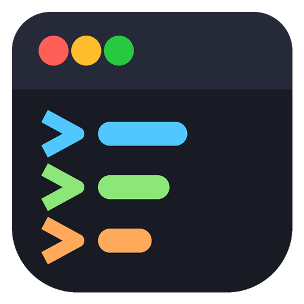
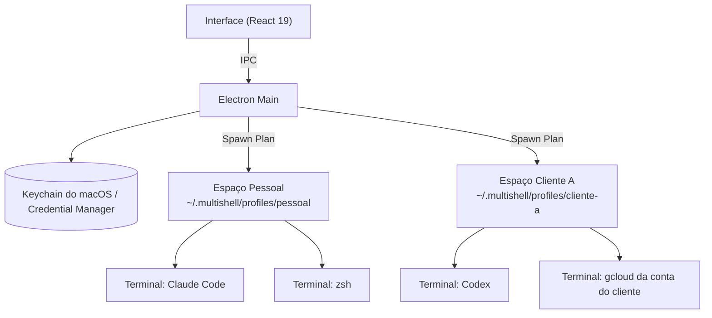

<p align="center">
  
</p>

<h1 align="center">Multishell</h1>

<p align="center">
  <strong>Vários agentes de IA em paralelo, cada espaço com seu próprio <code>HOME</code> e suas próprias credenciais.</strong><br>
  macOS e Windows • Bilingue (PT-BR & EN) • Electron 44 + React 19 + TypeScript
</p>

<p align="center">
  <a href="https://github.com/guistela/multishell-gs/actions/workflows/ci.yml"></a>
  <a href="https://github.com/guistela/multishell-gs/actions/workflows/security.yml"></a>
  
  
  
</p>

---

## Por que

Rodando Claude Code, Codex e Antigravity ao mesmo tempo, tudo divide o mesmo `$HOME`. Isso significa:

1. **Credenciais misturadas.** O login do `gcloud` de um cliente vale no projeto do outro. Trocar exige `logout`/`login` o tempo todo.
2. **Configuração disputada.** `~/.claude.json`, `~/.codex/config`, `~/.gitconfig` e `~/.ssh` são um só para todo mundo.
3. **Bypass sem fronteira.** Um agente com `--dangerously-skip-permissions` enxerga as chaves de todos os seus projetos.

O Multishell cria **Espaços**: cada um com `HOME` próprio, cofre de segredos no chaveiro do sistema e políticas de compartilhamento que você decide, item por item.

---

## Os três conceitos

| Conceito | O que é | Exemplo |
|---|---|---|
| **Provider** | A CLI que roda: executável, argumentos, variável de configuração e argumentos de bypass. | Claude Code (`CLAUDE_CONFIG_DIR`), Codex (`CODEX_HOME`), Antigravity, Cursor. |
| **Espaço** | O `HOME` isolado onde os terminais rodam, com seus segredos e suas regras. | `Pessoal`, `Cliente A`, `Open Source`. |
| **Terminal** | Uma sessão viva (`node-pty` + `@xterm/xterm`) dentro de um Espaço, com ou sem agente. | Claude Code no espaço Cliente A. |



---

## O que ele faz

### Isolamento
- `HOME` próprio por espaço, com `XDG_*` e as pastas de configuração de cada provider dentro dele.
- Compartilhamento opcional e explícito de Keychain, SSH, `.gitconfig`, variáveis do processo e perfil do shell. A barra de status mostra o que está aberto.
- Segredos no chaveiro do sistema via `@napi-rs/keyring` — nunca no JSON de configuração.
- Locale UTF-8 garantida no espaço, para acento não virar lixo ao copiar do terminal.

### Agentes
- **Handoff entre agentes.** Passa o contexto para outro terminal do espaço, ou abre outro agente e entrega o pacote quando o harness sobe. Útil quando um agente fica sem tokens no meio da tarefa.
- **Estado do agente no título.** Ponto pulsando quando ele está trabalhando, apagado quando terminou e espera você. Deduzido do fluxo do PTY.
- **Barra na seleção.** Selecionou texto no terminal: copiar, ou mandar o trecho para um agente de outro terminal com uma instrução junto.
- **Kanban local por espaço.** A tarefa é atribuída a um terminal e enviada ao agente dele. Tarefa também nasce da seleção do terminal.
- **MCP por espaço.** Servidores [Model Context Protocol](https://modelcontextprotocol.io/) configurados por perfil, gravados no `.mcp.json` que os harnesses leem.

### Operação
- **Contas.** Mostra as sessões de login das CLIs dentro do espaço — `gh`, `gcloud`, `az`, `firebase`, `aws`, `npm`, `kubectl`, `vercel`. Entrar e sair acontecem no terminal, porque esses fluxos são interativos.
- **Atividade.** Tráfego, tempo de vida e memória por terminal. Selo de aviso quando um passa de 1 GB.
- **Snapshots.** Guarda o conteúdo dos arquivos modificados e rastreados pelo git na pasta do terminal, com rollback confirmado.
- **Guardrail de comandos digitados.** Opcional, ligado por espaço: barra `rm -rf /`, fork bomb, `mkfs` e `dd` em disco no que você digita ou cola. Não alcança o agente, que roda dentro do terminal e cria os próprios processos; para conter o agente use o modo sem bypass ou um snapshot antes.
- **Terminais.** Abas por espaço, layouts (único, grade, vertical, horizontal, lista), tema por terminal e janelas destacadas em outro monitor sem derrubar o processo.

---

## Instalação

### macOS

**Instalador pronto**

1. Baixe em [Releases](https://github.com/guistela/multishell-gs/releases):
   - Apple Silicon: `Multishell-*-mac-arm64.dmg`
   - Intel: `Multishell-*-mac-x64.dmg`
2. Abra o `.dmg` e arraste o Multishell para **Aplicativos**.
3. **Primeira abertura:** o build não é assinado com uma Developer ID paga, então o Gatekeeper reclama. Clique com o **botão direito** no app em `/Applications`, escolha **Abrir** e confirme.

**Do código-fonte**

```bash
# Node.js 22+, pnpm 11+ e Xcode Command Line Tools
git clone https://github.com/guistela/multishell-gs.git
cd multishell-gs
make install-mac
```

### Windows

**Instalador pronto**

1. Baixe `Multishell-*-win-x64.exe` em [Releases](https://github.com/guistela/multishell-gs/releases).
2. Execute o instalador NSIS.
3. Se aparecer o SmartScreen, clique em **Mais informações** e depois em **Executar assim mesmo**.

**Do código-fonte**

```powershell
# Node.js 22+, pnpm 11+ e Visual Studio Build Tools (C++)
git clone https://github.com/guistela/multishell-gs.git
cd multishell-gs\app
pnpm install
pnpm dist
```

---

## Uso

### Onde ficam os espaços

- macOS: `~/.multishell/profiles/<espaço>`
- Windows: `%USERPROFILE%\.multishell\profiles\<espaço>`

Essa pasta é o `HOME` do espaço. O terminal, porém, **abre na pasta de trabalho**: a pasta base do espaço, a pasta padrão das configurações ou o seu `HOME` real, nessa ordem.

### Políticas por espaço

Ao editar um Espaço você decide, um a um, o que ele enxerga do sistema:

- **Compartilhar SSH** — symlink para `~/.ssh`. Desligado, o espaço tem chaves próprias.
- **Compartilhar Git config** — usa seu `.gitconfig` global, ou mantém nome e e-mail de commit por cliente.
- **Compartilhar Keychain** (macOS) — libera ou não o chaveiro do sistema.
- **Perfil do shell** — carrega seu `.zshrc` ou roda um ambiente limpo.
- **Herdar variáveis do processo** — desligado, o espaço não vê o ambiente do host (nem `GH_TOKEN` e afins).
- **Bloquear comandos destrutivos** — liga o guardrail.

### Desenvolvimento

```bash
make dev             # modo desenvolvimento com HMR
make test            # Vitest: renderer + processo main
make typecheck       # TypeScript estrito
make dist            # empacota os instaladores
make security-check  # Gitleaks + Semgrep local
```

---

## Segurança

- `contextIsolation`, `sandbox` e `nodeIntegration: false` no renderer, com CSP restritiva. Tudo passa pelo preload.
- Nenhum comando roda com `shell: true`; chamadas externas usam `execFile` com argumentos separados.
- Segredos delegados ao chaveiro do sistema operacional.
- [Gitleaks](https://github.com/gitleaks/gitleaks) em hook de pre-commit e no CI; [Semgrep](https://semgrep.dev/) e CodeQL a cada push; Dependabot semanal.
- Reporte de vulnerabilidade: [SECURITY.md](SECURITY.md).

**O que o isolamento não é:** o `HOME` é separado e as credenciais ficam por espaço, mas o processo continua sendo um processo do seu usuário — ele lê e escreve em qualquer lugar do disco a que você tem acesso. Não é sandbox de sistema operacional.

---

## Documentação

- [Arquitetura de isolamento](docs/ARQUITETURA-ISOLAMENTO.md)
- [Contrato da API entre renderer e main](docs/CONTRATO-API.md)

---

## Licença

MIT. Veja [LICENSE](LICENSE).
