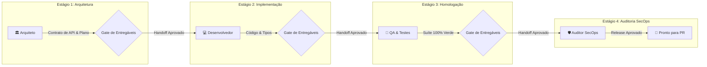

# 📜 Guia de Atuação Contratual Multiagente e Continuidade entre Harnesses

Quando desenvolvemos software em par com múltiplos agentes de IA (Claude Code, Gemini CLI, OpenAI Codex, Antigravity, Cursor, etc.), a maior causa de falhas é a **perda de contexto no handoff** e a **falta de limites claros de atuação**.

O **Multishell** introduz o conceito de **Carta de Atuação Contratual Multiagente (Project Agent Charter)** e o **Protocolo de Continuidade (Handoff Packets)** para transformar sessões isoladas de terminal em uma equipe coesa de especialistas coordenados.

---

## 🎯 Por que Contratos Multiagente?

1. **Especialização de Papéis:** Um agente focado em segurança não deve ficar inventando telas; um agente arquiteto não deve commitar código antes de definir contratos de interface.
2. **Continuidade entre Modelos Diferentes:** O Claude 3.7 Sonnet pode ser excelente para planejar e arquitetar, enquanto o Gemini 2.5 Pro ou o Codex podem ser ideais para varrer suítes massivas de testes ou fazer auditoria de dependências.
3. **Validação Estrita de Entregáveis (Deliverables Gate):** A passagem de bastão (handoff) só é autorizada se o agente anterior entregar as evidências acordadas no contrato (ex: "especificação técnica aprovada", "100% de testes passando", "0 alertas no Gitleaks").

---

## 🏗️ Estrutura do Contrato (`app/electron/agent-contracts.ts`)

Cada projeto ou Espaço no Multishell pode ter um arquivo `.multishell/agent-charter.json`.



### 1. Papéis Especialistas Padronizados

| Papel | Especialidade | Harness Sugerido | Responsabilidades Contratuais |
|---|---|---|---|
| **🏛️ Arquiteto** | Design de Sistemas e APIs | Claude Code | Produzir contratos de interface (`.d.ts`, OpenAPI), avaliar retrocompatibilidade, validar impacto. |
| **💻 Desenvolvedor** | Implementação e Tipos | Claude / Cursor | Implementar código seguindo estritamente as especificações do Arquiteto, sem alterar escopo externo. |
| **🧪 QA Engineer** | Testes e Edge-cases | Gemini CLI / Codex | Criar testes unitários, de estresse e regressão; homologar que nenhum teste foi suprimido. |
| **🛡️ SecOps** | Segurança e Auditoria | Codex / AGY | Executar Gitleaks, Semgrep, validar que segredos não vazaram e auditar dependências npm/cargo. |

---

## 🔄 Protocolo de Continuidade & Handoff (`app/electron/council.ts`)

Quando um agente conclui seu turno ou atinge seu limite de atuação contratual, o Multishell sintetiza um **Handoff Packet**:

```json
{
  "sourceProvider": "claude",
  "targetProvider": "gemini",
  "spaceId": "space-work",
  "projectName": "Multishell Engine",
  "branchOrWorktree": "worktree/feat-pty",
  "taskSummary": "Módulo de ring buffer implementado em app/electron/pty.ts com capacidade de 256KB.",
  "modifiedFiles": ["app/electron/pty.ts", "app/electron/handlers.ts"],
  "testStatus": "passed",
  "nextActions": [
    "Escrever testes de estresse para múltiplos terminais simultâneos",
    "Validar comportamento no Windows PTY"
  ],
  "blockersOrRisks": [
    "Evitar chamadas com /bin/sh em ambientes win32"
  ]
}
```

### Prompt de Continuidade Gerado Automaticamente

Ao inicializar o terminal do próximo agente (ex: Gemini CLI), o Multishell injeta automaticamente o prompt com as responsabilidades contratuais do papel somadas ao pacote de continuidade:

```markdown
=== PROTOCOLO DE CONTINUIDADE MULTIAGENTE (HANDOFF) ===
Origem: [CLAUDE] -> Destino: [GEMINI]
Projeto: Multishell Engine | Espaço: space-work
Worktree / Branch Ativa: worktree/feat-pty

## Resumo do que já foi realizado:
Módulo de ring buffer implementado em app/electron/pty.ts com capacidade de 256KB.

## Arquivos Modificados no Turno Anterior:
- app/electron/pty.ts
- app/electron/handlers.ts

## Status dos Testes: [PASSED]

## ⚠️ Riscos / Bloqueios Identificados:
! Evitar chamadas com /bin/sh em ambientes win32

## Suas Próximas Ações Imediatas:
1. Escrever testes de estresse para múltiplos terminais simultâneos
2. Validar comportamento no Windows PTY
```

---

## ⚖️ Conselho Multi-Modelo (Arbitragem de Divergências)

Se dois agentes em terminais diferentes apresentarem propostas conflitantes (por exemplo: refatorar um módulo ou manter a arquitetura atual):

1. Cada modelo submete seu voto (`approve`, `reject` ou `needs_changes`), sua justificativa e seu nível de confiança (0.0 a 1.0).
2. O motor de arbitragem (`arbitrateOpinions`) calcula:
   - **Consenso Unânime:** Prossegue imediatamente.
   - **Maioria Qualificada (≥66% e confiança ≥0.75):** Prossegue com alerta de minoria.
   - **Divergência Crítica:** Pausa a execução e emite um alerta na UI do Multishell escalonando a decisão final para o desenvolvedor humano.

---

## 🛠️ Como Usar no Multishell

- **Gerar Charter Padrão:** O Multishell cria automaticamente o modelo `createDefaultProjectCharter(spaceId, projectName)`.
- **Portas e Worktrees Isolados:** Cada agente pode atuar em uma `git worktree` dedicada sem locks e sem conflito de portas de desenvolvimento (`SpacePortManager`).
- **Sentinela Ativo:** Caso algum agente tente violar as regras do contrato (como rodar `rm -rf /` ou commitar segredos), o Guardrail intercepta antes da execução.
